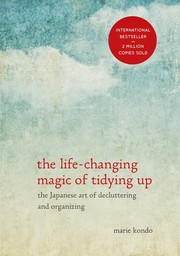
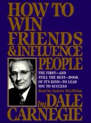
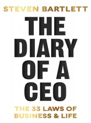

```{=html}
<style>
.quarto-layout-cell img {
  border: 1px solid #000;
}
.quarto-video {
  max-width: 75%;
  margin: 0 auto;
}
.quarto-video iframe {
  border: 1px solid #000;
}
.quarto-float-vid {
  text-align: center;
}
.quarto-layout-panel .quarto-video {
  max-width: 100%;
  margin: 0;
}
.quarto-layout-panel .quarto-float-vid {
  text-align: center;
}
.quarto-layout-panel .quarto-float-vid figcaption {
  font-size: 0.85em;
}
.quarto-layout-panel .quarto-layout-row {
  gap: 0;
}
blockquote {
  border-left: 4px solid #2e7d32;
  background-color: #f0f7f0;
  padding: 0.75em 1em;
  margin-left: 0;
  border-radius: 0 4px 4px 0;
}
blockquote table {
  width: auto !important;
  max-width: fit-content;
  font-size: 0.95em;
}
blockquote table td {
  border: none !important;
  padding: 2px 6px !important;
  white-space: nowrap;
}
.column-margin .quarto-float-vid {
  width: 350px;
  max-width: none;
}
.column-margin .quarto-video {
  max-width: 100%;
}
.star-rating {
  display: inline-block;
  position: relative;
  font-size: 1.1em;
  letter-spacing: 1px;
  vertical-align: middle;
  cursor: default;
}
.star-rating:hover::after {
  content: attr(data-rating);
  position: absolute;
  top: -2em;
  left: 50%;
  transform: translateX(-50%);
  background: #333;
  color: #fff;
  padding: 4px 8px;
  border-radius: 6px;
  font-size: 0.7em;
  white-space: nowrap;
  letter-spacing: 0;
}
.star-rating .star-full {
  color: #f5c518;
}
.star-rating .star-half {
  position: relative;
  display: inline-block;
  color: #d0d0d0;
}
.star-rating .star-half::before {
  content: "★";
  position: absolute;
  left: 0;
  overflow: hidden;
  width: 50%;
  color: #f5c518;
}
.star-rating .star-empty {
  color: #d0d0d0;
}
</style>
```

```{r wp-init, results='asis', echo=FALSE}
wikipediapreview::wp_init(use_unpkg = TRUE, use_alt_style = TRUE)
```

## Introduction

Welcome to the February 2026 roundup! Similar to
[last time](../../posts/2020-01-27-shrotriya2020january20roundup/){target="_blank"},
here I document anything interesting I come across each month, from
articles and books to skills and beyond. This is more for my personal
reference and benefit but may also help others.

## Summary

<!-- 2-3 line overview of highlights: key skills learned, books read,
     articles discovered, and anything else notable this month. -->

## Articles

### How Markdown Took Over the World

*by Anil Dash*
[🔗](https://www.anildash.com/2026/01/09/how-markdown-took-over-the-world/){target="_blank"}.

This was a really important historical overview over the rise of one of
the most ubiquitous[^fn-markdown-llms] text document formats used on the
web, i.e.
[markdown](https://daringfireball.net/projects/markdown/). Dash worked
at Movable Type, an influential blogging platform in the early 21st
century. Key takeaways:

> 1. **Motivation.**
>    [John Gruber](https://daringfireball.net/) originally developed
>    markdown *to simplify* his blogging experience with Movable Type.
> 2. **Success.** Is owed to a collection of favorable events and good
>    design, i.e. rise of blogging, brilliant branding (mark*down* as
>    the simplification of mark*up*), easy syntax which could be picked
>    up [in just a few minutes](https://docs.github.com/en/get-started/writing-on-github/getting-started-with-writing-and-formatting-on-github/basic-writing-and-formatting-syntax),
>    open-sourced (**not monetized**) with a helpful community.

On a personal note,
[Rmarkdown](https://rmarkdown.rstudio.com/index.html) was revolutionary
in developing reproducible and version-controlled data science
workflows. It showcased the power of
[literate programming](https://en.wikipedia.org/wiki/Literate_programming){.wiki}
in the "Big Data" era. With the rise of amazing packages like
[Quarto](https://quarto.org/docs/blog/), markdown continues to evolve
and still shapes blogging[^fn-this-blog] more than two decades
later 🎆.

[^fn-this-blog]: Including
    [this very blog](https://www.shamindras.com/posts){target="_blank"}
    🎉

[^fn-markdown-llms]: And increasingly so, with modern LLM specification
    docs like
    [MCP](https://modelcontextprotocol.io/){target="_blank"} and
    [skills](https://docs.anthropic.com/en/docs/claude-code/slash-commands){target="_blank"}.

## Tutorials

### LLMs in Five Formulas

*by Sasha Rush*
[▶️](https://www.youtube.com/watch?v=KCXDr-UOb9A&t=2989s){target="_blank"}.

:::::: {layout="[40, 60]" layout-valign="top"}
::: {#vid-feb26-llm-five-formulas}


[LLMs in Five Formulas](https://www.youtube.com/watch?v=KCXDr-UOb9A&t=2989s){target="_blank"}.
:::

:::: {}
A truly remarkable lecture by Prof. Rush's distilling the five features
of LLMs that make them 'tick'.

> | | | |
> |:--|:-:|:--|
> | 1. **Perplexity** | ⟷ | *Generation*. |
> | 2. **Attention** | ⟷ | *Memory*. |
> | 3. **GEMM** | ⟷ | *Scaling*. |
> | 4. **Chinchilla** | ⟷ | *Efficiency*. |
> | 5. **RASP** | ⟷ | *Reasoning*. |

::::
::::::

This tutorial really helped me to build a good mental model when
studying llms deeply, or applying them in practice. Prof. Rush
intentionally leaves out certain topics[^fn-rush-channel-topics] which
are also useful for explaining LLM performance, e.g. human feedback,
post-attention, new architectures, low-resource llms, and mechanistic
interpretability.

[^fn-rush-channel-topics]: However
    [his channel](https://www.youtube.com/@srush_nlp){target="_blank"}
    covers a few of these.

I plan to reflect on and return to this lecture multiple
times[^src-llm-five-formulas]. Highly recommend!

[^src-llm-five-formulas]: There is also a recorded
    [tutorial format](https://www.youtube.com/watch?v=k9DnQPrfJQs&t=3571s){target="_blank"}
    of this lecture if you prefer a slightly relaxed pace with
    interaction from the audience.

## Books

### Audiobooks

::: {.callout-caution collapse="true" icon=false}

## 🎯 Try Audiobooks - You Might Be Surprised

I came to a epiphany in early 2026, namely, that ***for me* self-help
books should be listened to as audiobooks** rather than read as
paperbacks. This simple change has made a world of difference. I
previously found the act of reading such books quite tedious and dry,
given their often prescriptive tone. Now I can use my idle walking time
to listen to them. Many audiobook platforms (e.g. Spotify, Audible)
include these titles in their premium memberships. In case you have felt
similarly about this genre, this tip might help you sample more of it.
There is often *some* nugget to take away from each one.

:::

#### The Life Changing Magic of Tidying Up

:::::: {layout="[15, 85]" layout-valign="top"}
{fig-alt="Book cover of The Life-Changing Magic of Tidying Up by Marie Kondo"}

:::: {}
*by Marie Kondo* (narrator: *Lucy Scott*)
[🎧](https://open.spotify.com/show/4evjgM54KB8lxxT87caPCd){target="_blank"}[^src-life-changing-magic].
<span class="star-rating" data-rating="4.5 / 5"><span class="star-full">★★★★</span><span class="star-half">★</span></span>

::: {.callout-note collapse="true" icon=false}

## Key Takeaways

This is a genuinely remarkable book and one that I'm more than a decade
late to[^fn-konmari-julian]. I had heard all of the "spark joy" memes
when the Netflix show landed, and simply assumed this was another
decluttering gimmick and ignored it. How wrong I was. This is a very
deep book about life prioritization disguised as a home tidying
manifesto. I learned many practical skills, but the main four biggest
takeaways were as follows.

> 1. **One and Done.** Marie Kondo (or 'KonMari') notes that tidying
>    your home should be **one-off** activity, *not* a recurring one as
>    often recommended by other books in this genre. This is the key
>    motivation to "get your house in order" as KonMari says.
> 2. **Categories not rooms.** An amazing approach of this book is to
>    focus on categories of items rather than rooms, when tidying ones
>    home. So tidying books doesn't mean to do a separate bookshelf each
>    day, but *all* bookshelves in the house at once. Moreover KonMari
>    mentions a prioritization order for categories to aid decision
>    fatigue: clothes, books, papers, komono (miscellaneous), and
>    sentimental items. It is **this** tip which makes the "one and
>    done" approach to tidying feasible.
> 3. **Qualitative > Quantitative.** The book emphasizes the use of
>    qualitative over quantitative decision making for tidying. So no
>    more "one in, one out" type rules to remember. Instead you get
>    advice like "when you are choosing what to keep, ask your heart,
>    when you are choosing where to store something, ask your house".
>    Strangely, I found this to be very practical.
> 4. **Principled.** *Maintaining* tidyness can be done via principled
>    methods, e.g. the
>    [KonMari folding technique](#the-konmari-fold).

An overarching theme of the book is that tidying is only the *first*
step towards prioritizing your life, not the final one. Highly
Recommend.

[^fn-konmari-julian]: Credit to
    [Julian Schrittwieser's reading list](https://www.julian.ac/read/){target="_blank"}
    for the recent nudge to finally pick this up.

:::
::::
::::::

[^src-life-changing-magic]: Image source for
    *The Life-Changing Magic of Tidying Up*:
    [Open Library](https://openlibrary.org/isbn/9781607747307){target="_blank"}.

#### How to Win Friends and Influence People

:::::: {layout="[15, 85]" layout-valign="top"}
{fig-alt="Book cover of How to Win Friends and Influence People by Dale Carnegie"}

:::: {}
*by Dale Carnegie* (narrator: *Andrew MacMillan*)
[🎧](https://open.spotify.com/show/3UfAQ6yAJQqHjifKaQ2Nm5){target="_blank"}[^src-win-friends].
<span class="star-rating" data-rating="3.5 / 5"><span class="star-full">★★★</span><span class="star-half">★</span><span class="star-empty">★</span></span>

::: {.callout-note collapse="true" icon=false}

## Key Takeaways

If I was asked to name "a classic in the motivational self-help
literature", this would be the first title that would come to mind.
Although I'm late to the party, this book ended up providing many
useful guidelines for improving my interactions with other people. The
book is split into fairly universal themes including: dealing with
people, becoming more likable, moving people towards your way of
thinking, and how to lead without causing offense. My main takeaways
were as follows.

> 1. **Positivity focus.** When dealing with other people always engage
>    with positivity, empathy, and kindness.
> 2. **Small sincere gestures.** Correctly pronouncing and acknowledging
>    the another's name ("the sweetest sound and most important sound to
>    that person"), asking thoughtful questions, listening intently, and
>    making the other person feel important are all good habits to
>    cultivate daily in a sincere manner.
> 3. **Discussion not argument.** Carnegie notes that there are never
>    any "winners" in an argument. He advocates for healthy debate where
>    necessary, but to avoid approaching it as a point scoring contest
>    to fuel one's ego. For me, the biggest win here is saving time and
>    energy by simply refusing to engage in trivial arguments.

Some critiques were that many of the references were a bit dated, but
these can be corrected for mentally, e.g. just replace "writing a
letter" with "sending an email/text". A more serious issue is that
Carnegie often plays out the 'best case' scenario for using his
strategies, and that many of his recommendations are not field tested
with formal experiments. But again, erring on the side of positivity is
not a bad approach to most interactions, so these should not be
dealbreakers and could be supplemented with more modern literature. Would
recommend.

:::
::::
::::::

[^src-win-friends]: Image source for
    *How to Win Friends and Influence People*:
    [Spotify](https://open.spotify.com/show/3UfAQ6yAJQqHjifKaQ2Nm5){target="_blank"}.

#### Diary of a CEO

:::::: {layout="[15, 85]" layout-valign="top"}
{fig-alt="Book cover of The Diary of a CEO by Steven Bartlett"}

:::: {}
*by Steven Bartlett* (narrated by *the author*)
[🎧](https://open.spotify.com/show/7iQXmUT7XGuZSzAMjoNWlX){target="_blank"}[^src-diary-of-a-ceo].
<span class="star-rating" data-rating="2.5 / 5"><span class="star-full">★★</span><span class="star-half">★</span><span class="star-empty">★★</span></span>

::: {.callout-note collapse="true" icon=false}

## Key Takeaways

This was recommended to me by Spotify audiobooks. The book title is
eponymous with a wildly popular podcast run by the author, where he
interviews various celebrities and entrepreneurs on lessons to improve
ones daily life. I had never listened to the podcast previously, so
went into this fresh. I enjoyed the fact that it was read by the author.
Interestingly, I learned more about eloquent storytelling and techniques
for effective message delivery through the audiobook reading than from
the contents of the book.

The book itself is framed as "The 33 laws for business and life" and
strikes quite a serious tone. Much of the business advice is framed in
the context of improving branding, e.g. "avoid wallpaper at all costs".
This is unsurprising given the author's background in building a
successful marketing firm in the UK. So ones mileage may vary depending
on your personal and professional goals. My main practical takeaway was:

> 1. **Small details matter.** Bartlett notes that "you must sweat the
>    small stuff", i.e. details matter. Here he emphasises the notion of
>    Kaizen as a business philosophy to measure and focus on incremental
>    gains in ones regular activities. He notes, for example, that his
>    podcast team go all out in interview preparation for new guests.
>    This involves thoroughly researching their guests and understanding
>    their preferences on intricacies like beverage, music, lighting,
>    and calibrating the interview room accordingly. I found this type
>    of focused attention to detail quite cool and practical. This
>    inspired me to apply the same principle to my own relationships, by
>    listening more attentively to friends and family and acting on
>    those details.

Overall, a fun modern take on motivational self-help, but would only
recommend if you are a fan of the podcast.

:::
::::
::::::

[^src-diary-of-a-ceo]: Image source for *The Diary of a CEO*:
    [Open Library](https://openlibrary.org/works/OL37187091W){target="_blank"}.

## Skills

I really enjoy learning new practical skills in a **principled manner**.
This way, even the most routine tasks become easy and, most importantly,
*fun* 🤹.

Here are some of the cool skills I picked up this month. Try them out!

### The KonMari Fold

*by Marie Kondo*
[▶️](https://www.youtube.com/watch?v=IjkmqbJTLBM&t=7s){target="_blank"}.

:::::: {layout="[40, 60]" layout-valign="top"}
::: {#vid-feb26-konmari-fold}


[The KonMari Fold](https://www.youtube.com/watch?v=IjkmqbJTLBM&t=7s){target="_blank"}.
:::

:::: {}
After recently becoming a [student of KonMari](#audiobooks), I decided
to raise my folding game with her method. Game changer! The main idea
can be summarized in three-steps:

> 1. **Shapes matter.** Rectangular shapes are easiest to repeatedly
>    fold down.
> 2. **Rectangulate.** First fold any item into the largest
>    rectangle[^fn-konmari-3d] (see video).
> 3. **Divide and stand.** Repeatedly fold down the rectangle so that
>    the item stands vertically.

::::
::::::

[^fn-konmari-3d]: Technically we are in 3D land, but we mean
    rectangles looking down 👀.

### Over/Under Roadie Wrap

*by Rattlesnake Cable Company*
[▶️](https://www.youtube.com/watch?v=zjpBXx8oNOc&t=2s){target="_blank"}.

:::::: {layout="[40, 60]" layout-valign="top"}
::: {#vid-feb26-roadie-wrap}


[Over/Under Roadie Wrap](https://www.youtube.com/watch?v=zjpBXx8oNOc&t=2s){target="_blank"}.
:::

:::: {}
After collecting hundreds of cables and wires over the years, I'd never
learned a proper way to coil them. The "roadie-wrap" is a well-tested
technique used by grips who have to coil (and uncoil!) hundreds of
cables daily. It works a treat with these gains:

> 1. **Tangle-free.** Uncoiling doesn't lead to tangles.
> 2. **Easy recoiling.** Recoiling is a matter of nailing the
>    over/under technique (see video).
> 3. **Durability.** Use this on all cables, and they will last a lot
>    longer.

::::
::::::

## Concluding Thoughts

Overall, this was quite an eventful month of activities for me. Also it
took all my energy to fire up the blog after a four year hiatus 😬.
Hopefully I'll keep adding to it more regularly this year!


