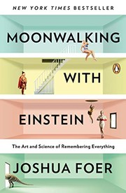

```{=html}
<style>
.quarto-layout-cell img {
  border: 1px solid #000;
}
.quarto-video {
  max-width: 75%;
  margin: 0 auto;
}
.quarto-video iframe {
  border: 1px solid #000;
}
.quarto-float-vid {
  text-align: center;
}
.column-margin .quarto-float-vid {
  width: 350px;
  max-width: none;
}
.column-margin .quarto-video {
  max-width: 100%;
}
</style>
```

## Introduction

Welcome to the February 2026 roundup! Similar to
[last time](../../posts/2020-01-27-shrotriya2020january20roundup/){target="_blank"}
I'm documenting anything interesting I come across and any activities
I get up to. This is more for my personal benefit but may also help
others.

## Summary

<!-- 2-3 line overview of highlights: key skills learned, books read,
     articles discovered, and anything else notable this month. -->

## Interesting Tutorials

[Large Language Models in Five Formulas](https://www.youtube.com/watch?v=KCXDr-UOb9A&t=2989s){target="_blank"} by Sasha Rush[^src-llm-five-formulas].

::: {.column-margin}
::: {#vid-feb26-llm-five-formulas}


Large Language Models in Five Formulas by Sasha Rush.
:::
:::

::: {.callout-tip collapse="true" icon=false}

## Key Takeaways

- A truly remarkable lecture distilling Prof. Rush's deep insights
  into the five features of LLMs that make them 'tick'.

:::

[^src-llm-five-formulas]: There is also a recorded
    [tutorial format](https://www.youtube.com/watch?v=k9DnQPrfJQs&t=3571s){target="_blank"}
    of this lecture if you prefer a slightly relaxed pace with
    interaction from the audience.

## Interesting Articles

[How Markdown took over the world](https://www.anildash.com/2026/01/09/how-markdown-took-over-the-world/){target="_blank"} by Anil Dash.

::: {.callout-tip collapse="true" icon=false}

## Key Takeaways

- We really are in the era of markdown-driven development.

:::

## Interesting Books

### Audiobooks

I came to a reading epiphany this month, that *for me* **self-help books should be listened to as audiobooks** rather than read on paperback. This simple change has made a world of difference. I previously found the act of reading such books quite tedious and dry, given their prescriptive tone. Now I can use my morning and evening walks to actively listen, without taking more time out of my day. Since I have Spotify premium, many books (including those listed below) are included in the membership. In case you feel similarly, this tip might help you sample more of this genre. There is often *some* nugget of truth to take away from each one.

:::::: {layout="[15, -2, 83]" layout-valign="top"}
{fig-alt="Book cover of The Life-Changing Magic of Tidying Up by Marie Kondo"}

:::: {}
[Life Changing Magic of Tidying Up (audiobook)](https://open.spotify.com/show/4evjgM54KB8lxxT87caPCd){target="_blank"} by Marie Kondo (narrated by Lucy Scott)[^src-life-changing-magic].

::: {.callout-tip collapse="true" icon=false}

## Key Takeaways

This is a genuinely remarkable book and one that I'm more a decade late to. I had heard all of the "spark joy" memes when the Netflix show landed, and simply assumed this was another basic decluttering gimmick and ignored it. How wrong I was. This is a very deep book about life prioritization disguised as a home tidying manifesto. I learned many practical skills, but the main three biggest takeaways were as follows. First, Marie Kondo (or 'KonMari') notes that tidying your home should be *one-off* activity, not a recurring one. Second, the book emphasizes the use of qualitative decision making over quantitative for tidying. And finally, maintaining tidyness can be done via principled methods, e.g. the KonMari folding technique. A bonus lesson from the book, is that tidying is the *first* step towards building a better you, not the final one.

:::
::::
::::::

[^src-life-changing-magic]: Image source for
    *The Life-Changing Magic of Tidying Up*:
    [Open Library](https://openlibrary.org/isbn/9781607747307){target="_blank"}.

:::::: {layout="[15, -2, 83]" layout-valign="top"}
{fig-alt="Book cover of The Diary of a CEO by Steven Bartlett"}

:::: {}
[Diary of a CEO (audiobook)](https://open.spotify.com/show/7iQXmUT7XGuZSzAMjoNWlX){target="_blank"} by Steven Bartlett (narrated by the author)[^src-diary-of-a-ceo].

::: {.callout-tip collapse="true" icon=false}

## Key Takeaways

- We really are in the era of markdown-driven development.

:::
::::
::::::

[^src-diary-of-a-ceo]: Image source for *The Diary of a CEO*:
    [Open Library](https://openlibrary.org/works/OL37187091W){target="_blank"}.

:::::: {layout="[15, -2, 83]" layout-valign="top"}
{fig-alt="Book cover of How to Win Friends and Influence People by Dale Carnegie"}

:::: {}
[How to Win Friends and Influence People (audiobook)](https://open.spotify.com/episode/1jDBhhffayv293DtCH4rSP){target="_blank"} by Dale Carnegie[^src-win-friends].

::: {.callout-tip collapse="true" icon=false}

## Key Takeaways

- We really are in the era of markdown-driven development.

:::
::::
::::::

[^src-win-friends]: Image source for
    *How to Win Friends and Influence People*:
    [Simon & Schuster Audio](https://open.spotify.com/episode/1jDBhhffayv293DtCH4rSP){target="_blank"}.

### Paperbacks

:::::: {layout="[15, -2, 83]" layout-valign="top"}
{fig-alt="Book cover of Moonwalking with Einstein by Joshua Foer"}

:::: {}
[Moonwalking with Einstein](https://www.amazon.com.au/Moonwalking-Einstein-Science-Remembering-Everything/dp/0143120530){target="_blank"} by Joshua Foer[^src-moonwalking-einstein].

::: {.callout-tip collapse="true" icon=false}

## Key Takeaways

- We really are in the era of markdown-driven development.

:::
::::
::::::

[^src-moonwalking-einstein]: Image source for
    *Moonwalking with Einstein*:
    [Open Library](https://openlibrary.org/isbn/9780143120537){target="_blank"}.

## Skills Learned

Learning how to do the roadie wrap. It goes like this. And add
one more point here. Try this again. And one more time.

### The KonMari Fold

[The KonMari Fold](https://www.youtube.com/watch?v=IjkmqbJTLBM&t=7s){target="_blank"} by Marie Kondo (YouTube channel).

::: {.column-margin}
::: {#vid-feb26-konmari-fold}


The KonMari Fold by Marie Kondo.
:::
:::

### Over/Under Roadie Wrap

[Over/Under Roadie Wrap](https://www.youtube.com/watch?v=zjpBXx8oNOc&t=2s&pp=ygULcm9hZGllIHdyYXA%3D){target="_blank"} by Rattlesnake Cable Company (YouTube channel).

::: {.column-margin}
::: {#vid-feb26-roadie-wrap}


Over/Under Roadie Wrap by Rattlesnake Cable Company.
:::
:::

## Concluding Thoughts
